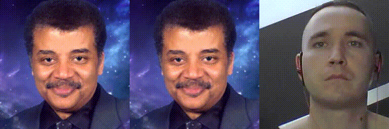
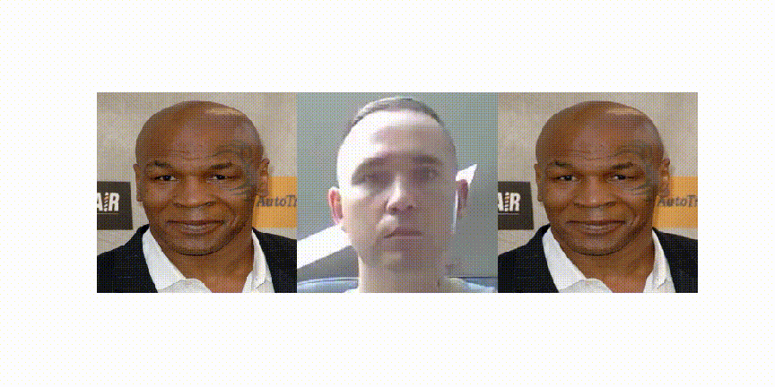

# Real time Image Animation - improved version with Docker config
The project allows you to play with animating images in real time (or generate from ready made video). With the help of the Docker configuration, 
you can run the jupyter notebook and bring a picture to life.

Photo bringed to life in real-time and saved to gif: 


Photo bringed to life from ready made video and saved to gif: 


This project is result of the work of many people. Please, take a look at the [Credits section](#credits) section!
This is what I improved:
1. Added Jupyter Notebook
2. Added a Docker configuration that allows you to launch whole project and being able to use the camera with OpenCV in Jupyter Notebook
3. Added `ffmpeg-python` to the installed packages and created methods for saving video files directly from the camera and converting files prepared earlier together with the crop and scale filter
4. (IMHO :smiley:) I simplified the code in jupyter a bit and made it more practical
5. Added short instructions and explanations to the code

## Installation and run

To build docker image run:
```
./build.sh
```
and to run container, please run:
```
./run.sh
```

You should see link to jupyter notebook in terminal, something like this:
```
http://127.0.0.1:8888/?token=edb9623d6c4ff0eac3096f88bb53ed1f3cfefdd9468f06ab
```
After you open the Jupyter please run `demo.ipynb` notebook and follow instructions and notes included in it.

## Training on your own dataset
If you want to train the model yourself, you must follow the instructions of the author of the model's implementation - check [Credits section](#credits) .

## Credits
- Model is implemented using following paper:

```
@InProceedings{Siarohin_2019_NeurIPS,
  author={Siarohin, Aliaksandr and Lathuilière, Stéphane and Tulyakov, Sergey and Ricci, Elisa and Sebe, Nicu},
  title={First Order Motion Model for Image Animation},
  booktitle = {Conference on Neural Information Processing Systems (NeurIPS)},
  month = {December},
  year = {2019}
}
```

- Original author and project for model implementation 
    * [AliaksandrSiarohin](https://github.com/AliaksandrSiarohin/first-order-model)


- First project which has implemented the use of the model in real time
    * [anandpawara](https://github.com/anandpawara/Real_Time_Image_Animation)

If you like this project give your support to original authors of this project by giving github star :star: to author's projects!


